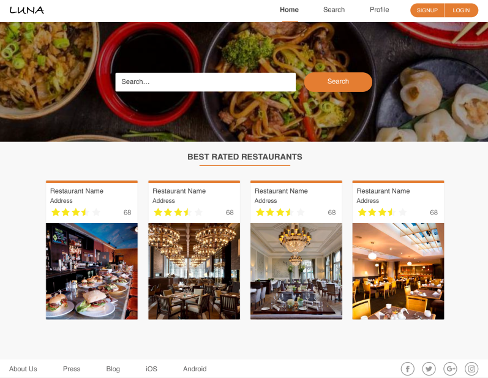

# 🍽️ Restaurant Review & Cookbook Sharing Platform

A full-stack web application where users can search restaurants, leave reviews, like/comment on recipes, and share their own cooking creations. Built using **React** and **Django REST Framework**, styled with **styled-components**, and deployed using **Docker**, **Nginx**, and **GitLab CI/CD** on DigitalOcean.

---

## 🖼️ Screenshot



---

## 🚀 Features

- 🔐 User Registration & Login (JWT-based)
- 🍽️ Restaurant Search & Detail View
- ⭐ Leave Reviews, Likes & Comments on Restaurants
- 📖 Create, Like & Comment on Recipes
- 👤 User Profiles
- 📦 RESTful API with Django REST Framework
- 💅 Frontend styled with Styled Components
- 🐳 Dockerized for development and production
- 🚀 GitLab CI/CD for automated deployment
- 🔥 Production-ready with Gunicorn + Nginx

---

## 🛠 Tech Stack

### Frontend:

- React
- React Router
- Axios
- Styled Components

### Backend:

- Django
- Django REST Framework
- Simple JWT
- PostgreSQL (or SQLite for local)

### DevOps:

- Docker
- Nginx
- Gunicorn
- GitLab CI/CD

---

## ⚙️ Local Development Setup

### Prerequisites

- Docker
- Git
- Node.js & npm (for local frontend development)

### 1. Clone the Repository

```bash
git clone https://github.com/itsatul/Restaurant-review-Cookbook-sharing-Platform.git
cd Restaurant-review-Cookbook-sharing-Platform
```

### 2. Environment Variables

Adopt `.env` file in the project root with appropriate Django and database configuration.

### 3. Run with Docker

```bash
docker-compose up --build
```

This will spin up:

- **Backend**: Django app running with Gunicorn
- **Frontend**: React app
- **Nginx**: Serving both apps
- **Database**: PostgreSQL

### 4. Migrate and Create Superuser

In a new terminal:

```bash
docker exec -it container sh -c "python manage.py migrate"
docker exec -it container sh -c "python manage.py createsuperuser"
```

---

### 🧪 Run Frontend Locally (without Docker)

For frontend-only development:

```bash
cd frontend
npm install
npm run dev
```

---

## 🌍 Access the App

- Frontend: [http://localhost:5173](http://localhost:5173)
- Admin Panel: [http://localhost:5173/backend/admin](http://localhost:5173/backend/admin)
- API docs: [http://localhost:5173/backend/docs](http://localhost:5173/backend/docs)

---

## 📦 GitLab CI/CD

This project includes a `.gitlab-ci.yml` file to automate:

- Build & test steps
- Docker image creation
- Deployment to production

Update variables in GitLab > Settings > CI/CD to match your environment.

---

## 🧱 Production Notes

- Use **HTTPS** via Nginx with Certbot
- Set `DEBUG=False` and configure allowed hosts
- Use persistent volume for DB and media files
- Use Gunicorn workers as per CPU count

---

## 📄 License

[MIT](LICENSE)

---

## ✨ Author

Made with ❤️ by **Atul Kumar Yadav and Constractor Acadamy team**
